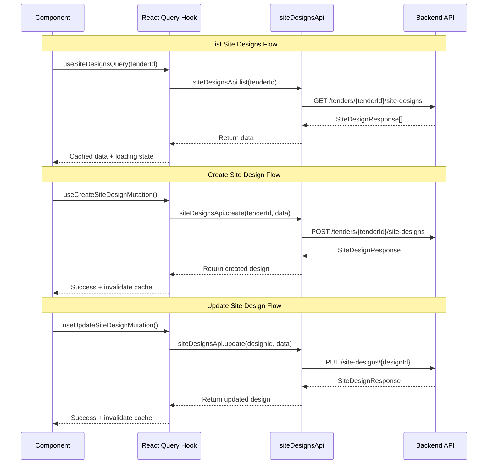

I have created the following plan after thorough exploration and analysis of the codebase. Follow the below plan verbatim. Trust the files and references. Do not re-verify what's written in the plan. Explore only when absolutely necessary. First implement all the proposed file changes and then I'll review all the changes together at the end.

## Observations

The codebase follows a consistent pattern for TypeScript types and API integration. The backend uses Pydantic schemas with UUID types, while the frontend uses string IDs. The existing code in `file:frontend/src/types/index.ts` defines types for tenders, PV designs, BOQ, etc., and `file:frontend/src/lib/api.ts` provides API methods using a `fetchApi` wrapper. The `file:frontend/src/lib/queryKeys.ts` uses a factory pattern for React Query cache keys. The backend site design schema includes enums, nested objects, and calculated fields that need to be accurately reflected in the frontend types.

## Approach

The implementation will follow the established patterns in the codebase. First, add TypeScript type definitions to `file:frontend/src/types/index.ts` based on the backend Pydantic schemas, converting UUID to string and ensuring all fields match. Second, add API methods to `file:frontend/src/lib/api.ts` following the same structure as existing APIs (tenders, PV designs, etc.). Third, extend the query keys factory in `file:frontend/src/lib/queryKeys.ts` to include site design keys. This approach ensures consistency with the existing codebase and provides type-safe API integration.

## Implementation Steps

### 1. Add Site Design Types to `file:frontend/src/types/index.ts`

Add the following type definitions after the existing types (around line 273):

**Enums:**
- `SiteTypeEnum`: Union type with values `'rooftop' | 'ground_mount' | 'carport'`
- `ModuleOrientationEnum`: Union type with values `'portrait' | 'landscape'`

**Nested Types:**
- `PlacementSettings`: Interface with fields:
  - `edge_setback_m`: number (default 1.0)
  - `row_spacing_m`: number (default 2.0)
  - `module_orientation`: ModuleOrientationEnum (default 'portrait')
  - `azimuth_deg`: number (default 180.0, range 0-360)
  - `tilt_deg`: number | null (optional, range 0-90)

**GeoJSON Type:**
- `GeoJSONPolygon`: Interface with:
  - `type`: string (must be "Polygon")
  - `coordinates`: number[][][] (array of linear rings)

**Main Types:**
- `SiteDesignResponse`: Interface matching backend schema with fields:
  - `id`: string
  - `tender_id`: string
  - `pv_design_id`: string | null
  - `name`: string
  - `site_type`: SiteTypeEnum
  - `equipment_module_id`: string
  - `equipment_inverter_id`: string
  - `site_boundary`: Record<string, any> (GeoJSON Polygon)
  - `exclusion_zones`: Record<string, any>[] (array of GeoJSON Polygons)
  - `module_placements`: Record<string, any>[] (array of placement data)
  - `placement_settings`: PlacementSettings
  - `total_modules`: number
  - `system_size_kwp`: number
  - `site_area_sqm`: number | null
  - `placement_task_id`: string | null
  - `placement_task_status`: string | null
  - `placement_task_error`: string | null
  - `placement_calculated_at`: string | null
  - `created_at`: string
  - `updated_at`: string

- `SiteDesignCreate`: Interface for creation with required fields:
  - `name`: string
  - `site_type`: SiteTypeEnum
  - `equipment_module_id`: string
  - `equipment_inverter_id`: string
  - `site_boundary`: Record<string, any>
  - `placement_settings`: PlacementSettings (optional, will use defaults)

- `SiteDesignUpdate`: Interface for updates with all optional fields:
  - `name?`: string
  - `site_boundary?`: Record<string, any>
  - `exclusion_zones?`: Record<string, any>[]
  - `equipment_module_id?`: string
  - `equipment_inverter_id?`: string
  - `placement_settings?`: PlacementSettings
  - `site_type?`: SiteTypeEnum

### 2. Add Site Designs API Methods to `file:frontend/src/lib/api.ts`

**Import the new types** at the top of the file (around line 3-27), add:
- `SiteDesignResponse`
- `SiteDesignCreate`
- `SiteDesignUpdate`

**Add `siteDesignsApi` object** after the existing API objects (after `helioscopeApi` around line 254):

```typescript
export const siteDesignsApi = {
    list: (tenderId: string) =>
        fetchApi<SiteDesignResponse[]>(`/tenders/${tenderId}/site-designs`),

    get: (designId: string) =>
        fetchApi<SiteDesignResponse>(`/site-designs/${designId}`),

    create: (tenderId: string, data: SiteDesignCreate) =>
        fetchApi<SiteDesignResponse>(`/tenders/${tenderId}/site-designs`, {
            method: "POST",
            body: data,
        }),

    update: (designId: string, data: SiteDesignUpdate) =>
        fetchApi<SiteDesignResponse>(`/site-designs/${designId}`, {
            method: "PUT",
            body: data,
        }),

    delete: (designId: string) =>
        fetchApi<void>(`/site-designs/${designId}`, {
            method: "DELETE",
        }),
};
```

### 3. Add Query Keys to `file:frontend/src/lib/queryKeys.ts`

**Add `siteDesigns` key factory** to the `queryKeys` object (after `boq` around line 56):

```typescript
// Site Design queries
siteDesigns: {
    all: ["site-designs"] as const,
    lists: () => [...queryKeys.siteDesigns.all, "list"] as const,
    list: (tenderId: string) =>
        [...queryKeys.siteDesigns.lists(), tenderId] as const,
    details: () => [...queryKeys.siteDesigns.all, "detail"] as const,
    detail: (designId: string) =>
        [...queryKeys.siteDesigns.details(), designId] as const,
},
```

This follows the same pattern as `pvDesigns` and `boq` query keys, providing:
- `queryKeys.siteDesigns.all` - Base key for all site design queries
- `queryKeys.siteDesigns.list(tenderId)` - Key for listing designs by tender
- `queryKeys.siteDesigns.detail(designId)` - Key for individual design details

## Architecture Diagram



## Type Mapping Reference

| Backend (Pydantic) | Frontend (TypeScript) | Notes |
|-------------------|----------------------|-------|
| `UUID` | `string` | All IDs converted to string |
| `datetime` | `string` | ISO 8601 format |
| `Optional[T]` | `T \| null` | Nullable types |
| `List[T]` | `T[]` | Arrays |
| `Dict[str, Any]` | `Record<string, any>` | GeoJSON objects |
| `SiteTypeEnum` | `'rooftop' \| 'ground_mount' \| 'carport'` | String literal union |
| `ModuleOrientationEnum` | `'portrait' \| 'landscape'` | String literal union |
| `PlacementSettings` | `PlacementSettings` | Nested interface |