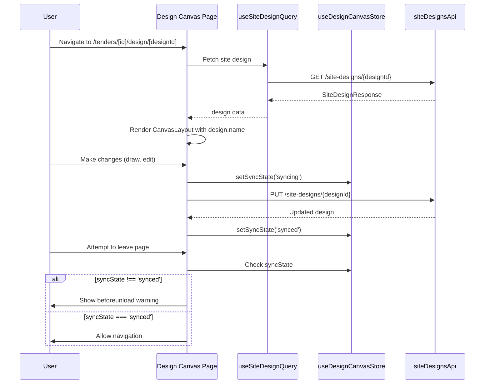

I have created the following plan after thorough exploration and analysis of the codebase. Follow the below plan verbatim. Trust the files and references. Do not re-verify what's written in the plan. Explore only when absolutely necessary. First implement all the proposed file changes and then I'll review all the changes together at the end.

## Observations

The design canvas page currently uses `useDesignQuery` from `useDesignCanvas.ts` which fetches PV designs. The new implementation needs to switch to site designs using `useSiteDesignQuery` from the already-implemented `useSiteDesigns.ts` hook. The existing components (Toolbar, RightPanel, FloatingPalette) have basic structure but need updates to match the wireframe requirements. The beforeunload handler is already implemented correctly. The codebase uses lucide-react for icons and shadcn/ui components.

## Approach

Replace the PV design query with site design query in the design canvas page, update the Toolbar to display the design name and add a "Generate Proposal" button, enhance the RightPanel with placeholder panels for equipment selection and placement settings, and update the FloatingPalette tools to match the wireframe specification (Draw Roof, Draw Ground, Draw Carport, Draw Exclusion). All changes maintain the existing auto-save sync state tracking and beforeunload warning functionality.

## Implementation Steps

### 1. Update Design Canvas Page (`file:frontend/src/app/tenders/[id]/design/[designId]/page.tsx`)

**Replace PV Design Query with Site Design Query:**
- Import `useSiteDesignQuery` from `@/hooks/useSiteDesigns` instead of `useDesignQuery` from `@/hooks/useDesignCanvas`
- Replace the query call from `useDesignQuery(designId)` to `useSiteDesignQuery(designId)`
- Update the CanvasLayout title prop to use `design.name` instead of `design.module_model`
- The beforeunload handler is already correctly implemented and checks `syncState !== 'synced'`, so no changes needed there

**Error Handling:**
- Keep the existing loading and error states as they are
- The error handling already works correctly with the new hook

### 2. Update Toolbar Component (`file:frontend/src/components/DesignCanvas/Toolbar.tsx`)

**Add Design Name Display:**
- The title prop already displays the design name, so this is already handled by passing `design.name` from the page component

**Add Generate Proposal Button:**
- Import `FileText` icon from `lucide-react`
- Add a new button after the "Save Copy" button with the following:
  - Variant: `"default"`
  - Size: `"sm"`
  - Icon: `FileText` with classes `"h-4 w-4 mr-2"`
  - Text: "Generate Proposal"
  - onClick handler: placeholder function that logs to console (actual implementation is out of scope)

**Sync State Indicator:**
- Keep the existing sync state display as-is (already correctly implemented)

### 3. Update Right Panel Component (`file:frontend/src/components/DesignCanvas/RightPanel.tsx`)

**Add Equipment Selection Panel:**
- Import `Wrench` icon from `lucide-react` for equipment section
- Replace the "No items selected" placeholder with two collapsible sections:
  1. **Equipment Selection Panel:**
     - Header with `Wrench` icon and "Equipment" text
     - Placeholder content: "Equipment selection UI - Out of scope"
     - Use a Card component from `@/components/ui/card` with padding
  2. **Placement Settings Panel:**
     - Header with `Settings` icon (already imported) and "Placement Settings" text
     - Placeholder content: "Placement settings UI - Out of scope"
     - Use a Card component from `@/components/ui/card` with padding

**Layout:**
- Wrap both panels in a flex column with gap spacing
- Add subtle borders and background colors to distinguish the panels
- Keep the existing collapse/expand functionality

### 4. Update Floating Palette Component (`file:frontend/src/components/DesignCanvas/FloatingPalette.tsx`)

**Update Tool Definitions:**
- Replace the existing tools array with the following tools:
  1. **Select Tool:**
     - id: `'select'`
     - icon: `MousePointer2` (already imported)
     - label: `'Select'`
  2. **Draw Roof:**
     - id: `'roof'`
     - icon: `Home` (import from `lucide-react`)
     - label: `'Draw Roof'`
  3. **Draw Ground:**
     - id: `'ground'`
     - icon: `Mountain` (import from `lucide-react`)
     - label: `'Draw Ground'`
  4. **Draw Carport:**
     - id: `'carport'`
     - icon: `Car` (import from `lucide-react`)
     - label: `'Draw Carport'`
  5. **Draw Exclusion:**
     - id: `'exclusion'`
     - icon: `Ban` (import from `lucide-react`)
     - label: `'Draw Exclusion'`

**Tool Selection Logic:**
- Keep the existing tool selection logic that sets mode to 'select' for the select tool and 'draw' for all other tools
- The selectedTool state should be set to the tool id when clicked
- Active state should highlight the currently selected tool

### 5. Verify Zustand Store Integration

**No Changes Required:**
- The `useDesignCanvasStore` already has the correct `syncState` tracking
- The `useSiteDesigns.ts` hooks already integrate with the store via `setSyncState`
- The beforeunload handler in the page component already uses the store correctly

## Visual Reference

## Component Structure

| Component | Updates | Key Props/State |
|-----------|---------|-----------------|
| **Design Canvas Page** | Replace `useDesignQuery` with `useSiteDesignQuery`, update title to use `design.name` | `tenderId`, `designId`, `design`, `syncState` |
| **Toolbar** | Add "Generate Proposal" button with `FileText` icon | `tenderId`, `title`, `syncState` |
| **RightPanel** | Add Equipment Selection and Placement Settings placeholder panels | `rightPanelOpen`, `toggleRightPanel` |
| **FloatingPalette** | Update tools to: Select, Draw Roof, Draw Ground, Draw Carport, Draw Exclusion | `mode`, `selectedTool`, `setMode`, `setSelectedTool` |

## Notes

- All placeholder UI elements should clearly indicate they are out of scope for this ticket
- The actual map implementation and drawing functionality are out of scope
- The Generate Proposal button should only log to console for now
- Equipment selection and placement settings panels are placeholder UI only
- The sync state management and beforeunload warning are already correctly implemented