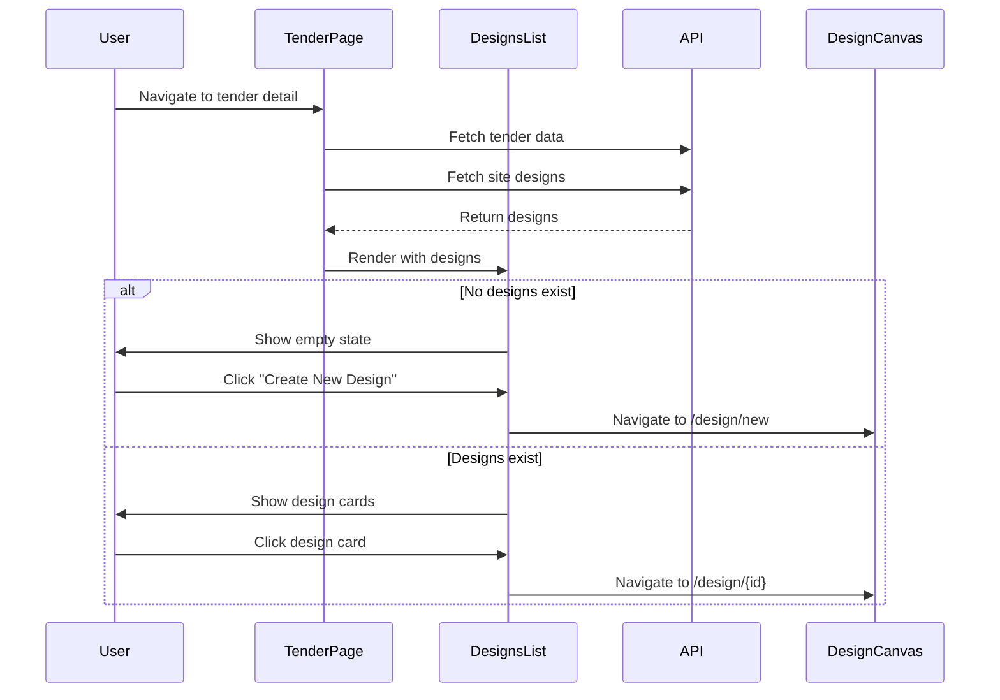

I have created the following plan after thorough exploration and analysis of the codebase. Follow the below plan verbatim. Trust the files and references. Do not re-verify what's written in the plan. Explore only when absolutely necessary. First implement all the proposed file changes and then I'll review all the changes together at the end.

## Observations

The tender detail page currently displays tender information and project modules as navigation buttons. The codebase uses shadcn/ui components with Tabs for organizing content, Card components for displaying information, and EmptyState for showing when no data exists. The `useSiteDesignsQuery` hook is available for fetching site designs, and the SiteDesignResponse type includes fields like name, total_modules, system_size_kwp, and created_at. Navigation patterns use Next.js router with Link components and the useRouter hook.

## Approach

Add a tabbed interface to the tender detail page with "Overview" and "Designs" tabs. The Designs tab will display a grid of design cards showing key metrics (name, created date, total modules, system size). When no designs exist, show an empty state with a "Create New Design" button. Clicking a design card navigates to the design canvas page. This approach maintains consistency with existing UI patterns and provides a clear, intuitive interface for managing multiple site designs per tender.

## Implementation Steps

### 1. Update Tender Detail Page Structure

**File:** `file:frontend/src/app/tenders/[id]/page.tsx`

Add tabs to organize the page content:

- Import `Tabs`, `TabsList`, `TabsTrigger`, `TabsContent` from `@/components/ui/tabs`
- Import `useSiteDesignsQuery` from `@/hooks/useSiteDesigns`
- Add state for active tab: `const [activeTab, setActiveTab] = useState("overview")`
- Fetch site designs using: `const { data: siteDesigns, isLoading: isLoadingDesigns } = useSiteDesignsQuery(id)`
- Wrap the existing content (from line 124 onwards) in a `Tabs` component with `value={activeTab}` and `onValueChange={setActiveTab}`
- Create `TabsList` with two triggers: "Overview" and "Designs"
- Move existing content into `TabsContent` with `value="overview"`
- Add new `TabsContent` with `value="designs"` for the designs list

### 2. Create DesignsList Component

**File:** `file:frontend/src/components/SiteDesigns/DesignsList.tsx` (new file)

Create a component to display site designs in a grid layout:

- Accept props: `designs: SiteDesignResponse[]`, `tenderId: string`, `isLoading: boolean`
- Import necessary components: `Card`, `CardHeader`, `CardTitle`, `CardContent`, `CardDescription` from `@/components/ui/card`
- Import `Button` from `@/components/ui/button`
- Import `EmptyState` from `@/components/common/EmptyState`
- Import `Skeleton` from `@/components/ui/skeleton`
- Import icons: `Plus`, `Layers`, `Calendar`, `Zap` from `lucide-react`
- Import `format` from `date-fns`
- Import `useRouter` from `next/navigation`
- Import `Link` from `next/link`

**Loading State:**
- When `isLoading` is true, render a grid of 3 skeleton cards
- Each skeleton should show placeholder for card header and content

**Empty State:**
- When `designs.length === 0` and not loading, render `EmptyState` component
- Use `Layers` icon
- Title: "No designs created yet"
- Description: "Create your first site design to start planning the solar installation"
- Action: Button with "Create New Design" that navigates to `/tenders/${tenderId}/design/new`

**Design Cards Grid:**
- Render designs in a responsive grid: `grid grid-cols-1 md:grid-cols-2 lg:grid-cols-3 gap-4`
- Each design card should be clickable and navigate to `/tenders/${tenderId}/design/${design.id}`
- Use `Card` component with hover effect: `hover:shadow-lg transition-shadow cursor-pointer`

**Card Content:**
- **Header:** Display design name as `CardTitle` and created date as `CardDescription` using `format(new Date(design.created_at), "MMM d, yyyy")`
- **Content:** Show key metrics in a grid:
  - Total Modules: Display `design.total_modules` with `Layers` icon
  - System Size: Display `design.system_size_kwp.toFixed(2)} kWp` with `Zap` icon
  - Site Type: Display `design.site_type` (capitalize first letter)
  - Module: Display `design.equipment_module_id` (truncate if too long)

### 3. Add Create New Design Button

In the Designs tab header (before the DesignsList component):

- Add a flex container with space-between alignment
- Left side: Heading "Site Designs"
- Right side: Button with `Plus` icon and "Create New Design" text
- Button should navigate to `/tenders/${id}/design/new` using Next.js Link component
- Style button with primary variant

### 4. Integrate DesignsList into Tender Detail Page

**File:** `file:frontend/src/app/tenders/[id]/page.tsx`

In the "designs" TabsContent:

- Import the `DesignsList` component
- Add a header section with title and create button
- Render `DesignsList` component passing:
  - `designs={siteDesigns || []}`
  - `tenderId={id}`
  - `isLoading={isLoadingDesigns}`

### 5. Handle Navigation to Design Canvas

The navigation is handled by:

- Wrapping each design card in a Link component pointing to `/tenders/${tenderId}/design/${design.id}`
- The "Create New Design" button linking to `/tenders/${tenderId}/design/new`
- Using Next.js client-side navigation for smooth transitions

## Visual Structure



## Component Structure

```
TenderDetailPage
├── Tabs
│   ├── TabsList
│   │   ├── TabsTrigger (Overview)
│   │   └── TabsTrigger (Designs)
│   ├── TabsContent (Overview)
│   │   └── [Existing content]
│   └── TabsContent (Designs)
│       ├── Header
│       │   ├── Title
│       │   └── Create Button
│       └── DesignsList
│           ├── Loading State (Skeletons)
│           ├── Empty State
│           └── Design Cards Grid
│               └── Card (per design)
│                   ├── CardHeader (name, date)
│                   └── CardContent (metrics)
```