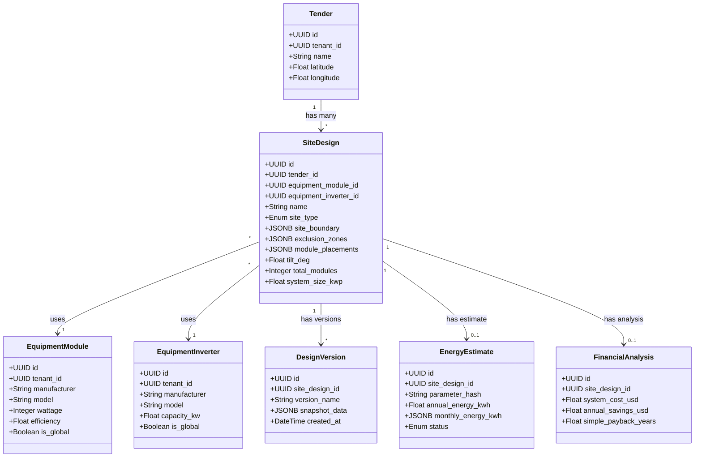

I have created the following plan after thorough exploration and analysis of the codebase. Follow the below plan verbatim. Trust the files and references. Do not re-verify what's written in the plan. Explore only when absolutely necessary. First implement all the proposed file changes and then I'll review all the changes together at the end.

## Observations

The codebase is a FastAPI + SQLAlchemy + PostgreSQL application with Alembic for migrations. Currently, there are no migration files in `file:backend/alembic/versions/` (only README). The existing models in `file:backend/app/models/models.py` follow a clear pattern with UUID primary keys, tenant isolation, enums for status fields, and relationship definitions. The Tech Plan spec defines 6 new tables with GeoJSON data stored in JSONB columns, equipment libraries with global/tenant-specific flags, and hash-based cache invalidation for energy estimates.

## Approach

You'll implement a foundation-level database schema migration that adds 6 new tables (`site_designs`, `design_versions`, `equipment_modules`, `equipment_inverters`, `energy_estimates`, `financial_analyses`) following the exact specifications from the Tech Plan. The approach involves: (1) adding new SQLAlchemy model classes to the existing models file with proper enums, relationships, and JSONB columns for GeoJSON data, (2) creating an Alembic migration script with proper indexes for performance, and (3) creating a separate seed script to populate the global equipment library with common PV modules and inverters. This ensures backward compatibility (no changes to existing tables) and provides a clean foundation for subsequent service layer and API implementation.

## Implementation Steps

### 1. Add New Enum Types to Models File

**File:** `file:backend/app/models/models.py`

Add three new enum classes after the existing `TenderStatus` enum (around line 30):

- `SiteType` enum with values: `ROOFTOP`, `GROUND_MOUNT`, `CARPORT`
- `ModuleOrientation` enum with values: `PORTRAIT`, `LANDSCAPE`
- `EnergyEstimateStatus` enum with values: `CALCULATING`, `COMPLETED`, `FAILED`

Follow the existing pattern used for `UserRole` and `TenderStatus` (inherit from `str, PyEnum`).

### 2. Add New Model Classes

**File:** `file:backend/app/models/models.py`

Add six new model classes at the end of the file (after `AuditLog` class, around line 174):

#### EquipmentModule Model
- Table name: `equipment_modules`
- Columns: `id` (UUID), `tenant_id` (UUID, nullable, FK to tenants), `manufacturer`, `model`, `wattage`, `efficiency`, `length_m`, `width_m`, `thickness_m`, `voc`, `isc`, `vmp`, `imp`, `is_global` (Boolean), `is_active` (Boolean), `created_at` (DateTime)
- Relationship: `tenant` → `Tenant`
- Index on: `tenant_id`, `is_global`, `is_active`

#### EquipmentInverter Model
- Table name: `equipment_inverters`
- Columns: `id` (UUID), `tenant_id` (UUID, nullable, FK to tenants), `manufacturer`, `model`, `capacity_kw`, `max_dc_voltage`, `mppt_voltage_range_min`, `mppt_voltage_range_max`, `max_input_current`, `num_mppt_channels`, `is_global` (Boolean), `is_active` (Boolean), `created_at` (DateTime)
- Relationship: `tenant` → `Tenant`
- Index on: `tenant_id`, `is_global`, `is_active`

#### SiteDesign Model
- Table name: `site_designs`
- Import `JSONB` from `sqlalchemy.dialects.postgresql`
- Columns: `id` (UUID), `tender_id` (UUID, FK to tenders), `pv_design_id` (UUID, nullable, FK to pv_designs), `name`, `site_type` (Enum), `created_by` (UUID, FK to users), `created_at`, `updated_at`, `equipment_module_id` (UUID, FK to equipment_modules), `equipment_inverter_id` (UUID, FK to equipment_inverters), `site_boundary` (JSONB), `exclusion_zones` (JSONB, default=[]), `module_placements` (JSONB, default=[]), `edge_setback_m` (Float, default=1.0), `row_spacing_m` (Float, default=2.0), `module_orientation` (Enum, default=PORTRAIT), `azimuth_deg` (Float, default=180.0), `tilt_deg` (Float), `total_modules` (Integer, default=0), `system_size_kwp` (Float, default=0.0), `site_area_sqm` (Float, nullable)
- Relationships: `tender` → `Tender`, `pv_design` → `PVDesign`, `equipment_module` → `EquipmentModule`, `equipment_inverter` → `EquipmentInverter`, `versions` → `DesignVersion` (one-to-many), `energy_estimate` → `EnergyEstimate` (one-to-one), `financial_analysis` → `FinancialAnalysis` (one-to-one)
- Index on: `tender_id`, `created_by`, `equipment_module_id`, `equipment_inverter_id`

#### DesignVersion Model
- Table name: `design_versions`
- Columns: `id` (UUID), `site_design_id` (UUID, FK to site_designs), `version_name`, `notes` (Text, nullable), `created_by` (UUID, FK to users), `created_at`, `snapshot_data` (JSONB)
- Relationships: `site_design` → `SiteDesign`, `created_by_user` → `User`
- Index on: `site_design_id`, `created_at`

#### EnergyEstimate Model
- Table name: `energy_estimates`
- Columns: `id` (UUID), `site_design_id` (UUID, unique, FK to site_designs), `parameter_hash` (String(64)), `system_capacity_kw`, `latitude`, `longitude`, `azimuth`, `tilt`, `losses_pct` (Float, default=14.0), `annual_energy_kwh`, `monthly_energy_kwh` (JSONB), `capacity_factor`, `status` (Enum, default=CALCULATING), `error_message` (Text, nullable), `calculated_at`, `pvwatts_version` (String(50), nullable)
- Relationship: `site_design` → `SiteDesign`
- Index on: `site_design_id`, `parameter_hash`, `status`

#### FinancialAnalysis Model
- Table name: `financial_analyses`
- Columns: `id` (UUID), `site_design_id` (UUID, unique, FK to site_designs), `system_cost_usd`, `electricity_rate_usd_per_kwh`, `annual_rate_escalation_pct` (Float, default=2.0), `annual_savings_usd`, `simple_payback_years`, `roi_pct`, `calculated_at`
- Relationship: `site_design` → `SiteDesign`
- Index on: `site_design_id`

### 3. Update Existing Tender Model

**File:** `file:backend/app/models/models.py`

Add new relationship to the `Tender` class (around line 86, after `boq_items` relationship):
- `site_designs = relationship("SiteDesign", back_populates="tender")`

### 4. Create Alembic Migration Script

**Command:** Run `alembic revision -m "add_site_design_and_equipment_tables"`

**File:** `file:backend/alembic/versions/<timestamp>_add_site_design_and_equipment_tables.py`

In the `upgrade()` function:

1. Create `equipment_modules` table with all columns as specified
2. Create `equipment_inverters` table with all columns as specified
3. Create `site_designs` table with all columns as specified
4. Create `design_versions` table with all columns as specified
5. Create `energy_estimates` table with all columns as specified
6. Create `financial_analyses` table with all columns as specified
7. Create indexes:
   - `ix_equipment_modules_tenant_id` on `equipment_modules(tenant_id)`
   - `ix_equipment_modules_is_global` on `equipment_modules(is_global)`
   - `ix_equipment_inverters_tenant_id` on `equipment_inverters(tenant_id)`
   - `ix_equipment_inverters_is_global` on `equipment_inverters(is_global)`
   - `ix_site_designs_tender_id` on `site_designs(tender_id)`
   - `ix_site_designs_equipment_module_id` on `site_designs(equipment_module_id)`
   - `ix_site_designs_equipment_inverter_id` on `site_designs(equipment_inverter_id)`
   - `ix_design_versions_site_design_id` on `design_versions(site_design_id)`
   - `ix_energy_estimates_parameter_hash` on `energy_estimates(parameter_hash)`

In the `downgrade()` function:
- Drop all 6 tables in reverse order (financial_analyses, energy_estimates, design_versions, site_designs, equipment_inverters, equipment_modules)

### 5. Create Equipment Library Seed Script

**File:** `file:backend/scripts/seed_equipment.py` (new directory and file)

Create a standalone Python script that:

1. Imports necessary modules: `SessionLocal` from `file:backend/app/core/database`, `EquipmentModule`, `EquipmentInverter` from `file:backend/app/models/models`
2. Defines a list of 10+ common PV modules with realistic specifications:
   - Examples: Canadian Solar CS3W-400MS (400W), Jinko Tiger Pro JKM-540M (540W), Trina Solar TSM-DE09.08 (405W), LONGi LR5-72HPH-540M (540W), JA Solar JAM72S30-545/MR (545W), etc.
   - Include specifications: manufacturer, model, wattage, efficiency (18-22%), dimensions (length_m: 1.7-2.3, width_m: 1.0-1.3, thickness_m: 0.035-0.040), electrical specs (Voc: 45-50V, Isc: 10-14A, Vmp: 38-42V, Imp: 10-13A)
3. Defines a list of 5+ common inverters with realistic specifications:
   - Examples: SMA Sunny Tripower 25000TL (25kW), Fronius Symo 20.0-3 (20kW), Huawei SUN2000-100KTL (100kW), SolarEdge SE25K (25kW), ABB PVS-100-TL (100kW)
   - Include specifications: manufacturer, model, capacity_kw, max_dc_voltage (1000-1500V), MPPT ranges (min: 200-500V, max: 800-1000V), max_input_current (30-100A), num_mppt_channels (2-10)
4. Creates a `seed_equipment()` function that:
   - Opens a database session
   - Checks if global equipment already exists (query `is_global=True`)
   - If not exists, bulk inserts modules and inverters with `is_global=True`, `tenant_id=None`, `is_active=True`
   - Commits and closes session
5. Includes `if __name__ == "__main__":` block to run the seed function
6. Add error handling and logging for seed operations

### 6. Update Models __init__.py

**File:** `file:backend/app/models/__init__.py`

Add imports for the new models to ensure they're available for Alembic autogenerate:
- `from app.models.models import SiteDesign, DesignVersion, EquipmentModule, EquipmentInverter, EnergyEstimate, FinancialAnalysis`

### 7. Testing & Validation

Create a validation checklist:

1. **Migration Test:**
   - Run `alembic upgrade head` on a clean database
   - Verify all 6 tables are created with correct columns
   - Verify all indexes are created
   - Verify foreign key constraints are in place
   - Run `alembic downgrade -1` to test rollback
   - Run `alembic upgrade head` again to verify idempotency

2. **Seed Script Test:**
   - Run `python backend/scripts/seed_equipment.py`
   - Query database to verify at least 10 modules and 5 inverters exist with `is_global=True`
   - Verify all required fields are populated
   - Run seed script again to verify it doesn't create duplicates

3. **Model Validation:**
   - Import all models in Python shell
   - Verify relationships are bidirectional
   - Test creating a `SiteDesign` instance with equipment references
   - Verify JSONB columns accept GeoJSON structures

4. **Backward Compatibility:**
   - Verify existing tables (tenants, users, tenders, preconditions, pv_designs, boq_items, audit_logs) are unchanged
   - Verify existing relationships still work
   - Test creating a Tender and accessing its site_designs relationship

## Database Schema Diagram

## Equipment Library Structure

| Equipment Type | Count | is_global | tenant_id | Purpose |
|---------------|-------|-----------|-----------|---------|
| Modules | 10+ | True | NULL | Central library for all tenants |
| Inverters | 5+ | True | NULL | Central library for all tenants |

**Module Specifications Table:**

| Field | Type | Example | Range |
|-------|------|---------|-------|
| wattage | Integer | 400-550W | 300-700W |
| efficiency | Float | 20.5% | 18-22% |
| length_m | Float | 2.094m | 1.7-2.3m |
| width_m | Float | 1.134m | 1.0-1.3m |
| Voc | Float | 49.5V | 45-50V |
| Vmp | Float | 41.2V | 38-42V |

**Inverter Specifications Table:**

| Field | Type | Example | Range |
|-------|------|---------|-------|
| capacity_kw | Float | 25kW | 10-100kW |
| max_dc_voltage | Float | 1000V | 1000-1500V |
| mppt_range_min | Float | 200V | 200-500V |
| mppt_range_max | Float | 850V | 800-1000V |
| num_mppt_channels | Integer | 2 | 2-10 |