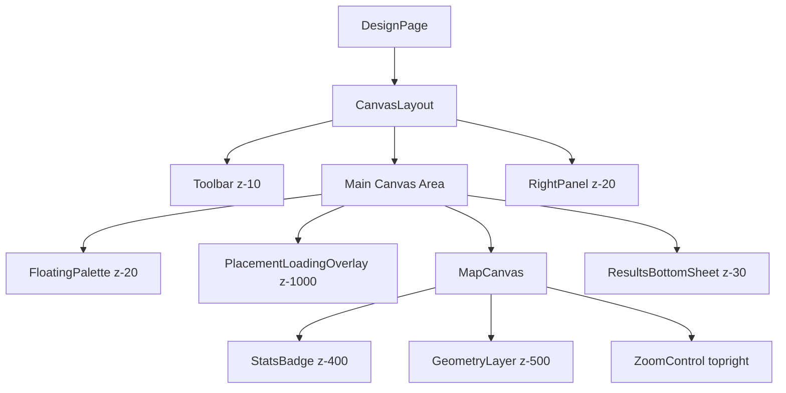

# ResultsBottomSheet Integration

This component displays design results, energy production estimates, and financial analysis in a tabbed bottom sheet.

## Architecture

**Location:** Rendered in `CanvasLayout.tsx` (line 29)
**Z-Index:** `z-30` (above base canvas, below overlays)
**Responsive Behavior:** Adjusts margin when right panel is open (`md:mr-[320px]`)
**Data Dependencies:** Requires `designId` prop to fetch energy and financial data from the backend.
**States:**

- **Collapsed:** Summary bar with key metrics (Total Modules, System Size, Annual Energy, Payback).
- **Expanded:** Tabbed details (System Overview, Energy Production, Financial Metrics).

## Component Hierarchy & Stacking

## Z-Index Hierarchy

| Layer | Component | Z-Index | Purpose |
| :--- | :--- | :--- | :--- |
| Overlay | PlacementLoadingOverlay | 1000 | Blocks interaction during placement |
| Controls | GeometryLayer visibility | 500 | Layer toggle controls |
| Badges | StatsBadge, Status indicator | 400 | Always-visible metrics |
| Modals | Sheet, Dialog, Tooltip | 50-100 | User interactions |
| Bottom Sheet | ResultsBottomSheet | 30 | Design results display |
| Panels | FloatingPalette, RightPanel | 20 | Tool selection and settings |
| Header | Toolbar | 10 | Navigation and actions |

## Data Flow & State Management

1. **Polling:** The component polls the energy estimation endpoint every 2 seconds when status is `calculating`.
2. **Timeout:** A 5-minute safeguard stops polling if the calculation takes too long.
3. **Stale Data:** A warning is shown if the design has been modified after the last energy estimation.
4. **Error Handling:** Graceful degradation is implemented for missing location data, zero capacity, and API failures.

## Known Limitations

- Bottom sheet requires BOQ data for financial analysis.
- Energy estimation depends on valid tender location coordinates.
- Polling timeout is set to 5 minutes.
- Chart rendering requires at least 1 month of data.
